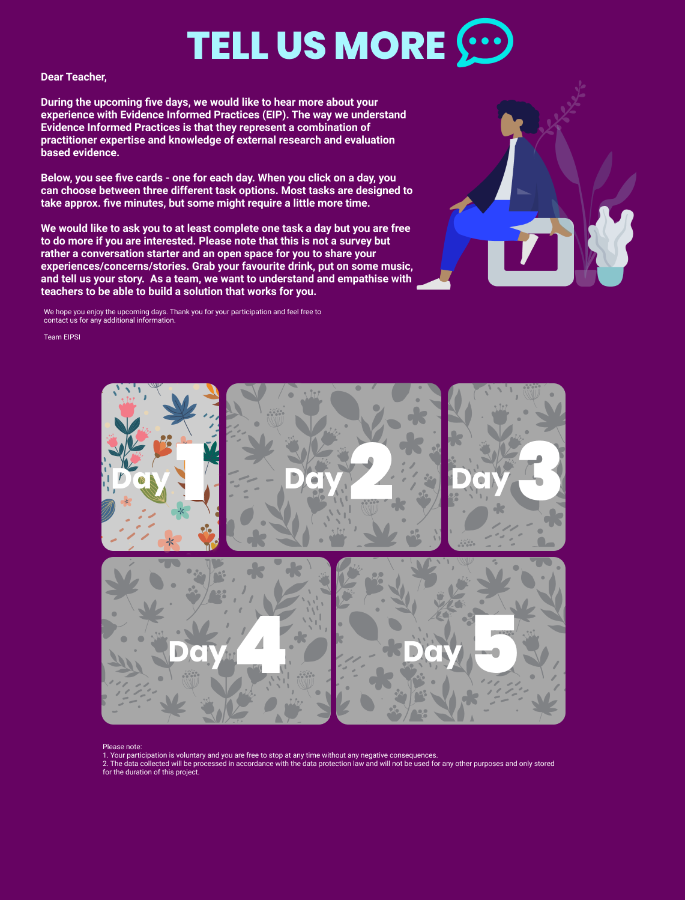
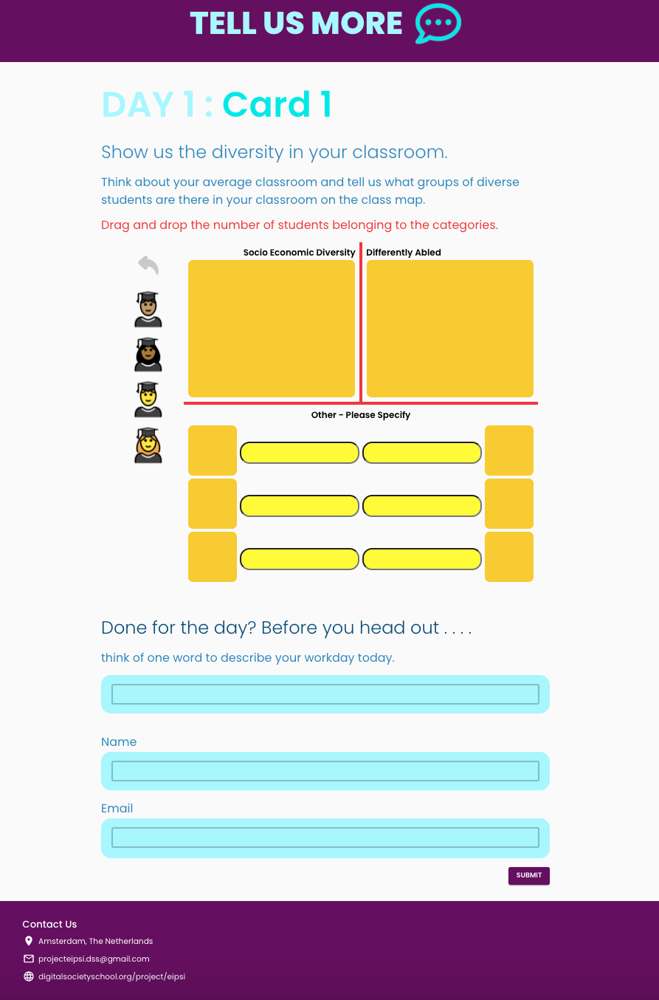

# EIPSI

This project aims to contribute to the improvement of Primary and Secondary School pupils’ academic outcomes and reducing the gap between advantaged and disadvantaged pupils through the promotion of Evidence Informed Practice for School Inclusion approach (EIPSI). The challenge is to design a prototype (open digital platform/a community) with the evidence-informed resources for teachers. 

Our showcase: https://eipsiproject.com





Introduction of the project: https://digitalsocietyschool.org/project/eipsi


## Development

Install dependencies:

```sh
npm install
```

Start development server:

```sh
npm start
```

Deploy to Github Pages:

```sh
npm run deploy
```
